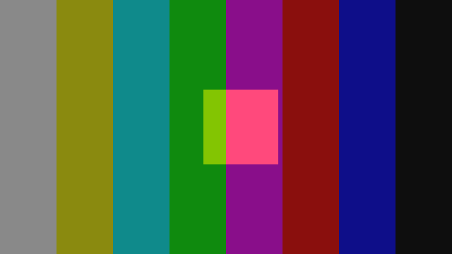
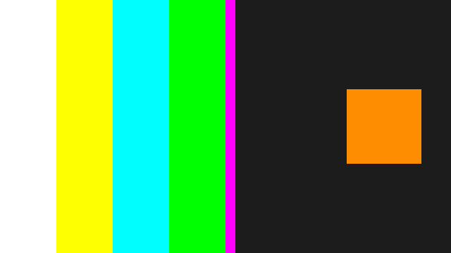

# MiniSwitcher

A software video production switcher: program/preview buses, frame-accurate
transitions, and a real-time compositing loop, written in C and C++.

The C layer owns memory and timing — packed UYVY 4:2:2 frames, a pre-allocated
frame pool, a lock-free SPSC queue, a monotonic frame cadence. The C++ layer
owns the show — the transition engine the operator actually drives.

| Colour bars | Dissolve, T-bar at 0.5 | Wipe, T-bar at 0.5 |
|---|---|---|
|  |  |  |

*Rendered by `switch_demo`, decoded to PNG by `scripts/yuv2png.py`.*

## Build and run

```bash
make && make test      # no dependencies beyond a C11/C++20 compiler
make demo              # renders demo.yuv at 640x360
make bench             # 1080p60 timing report, no file I/O
```

CMake is the primary build if you have it:

```bash
./scripts/build.sh          # configure, build, ctest
./scripts/build.sh --asan   # same, under ASan + UBSan
```

Raw UYVY carries no header, so playback needs the geometry:

```bash
./scripts/play.sh demo.yuv 640 360          # ffplay
python3 scripts/yuv2png.py demo.yuv 640 360 --frame 48 -o frame.png
```

## Performance

A switcher is a real-time system, so the number that matters is not the average
— it is whether any single frame missed its deadline.

```
$ make bench
bench: 300 frames at 1920x1080 @ 60.000 fps

composite time per frame (300 frames)
  budget   16666.7 us
  avg        189.3 us  ( 1.1% of budget)
  p50        187.5 us
  p99        230.0 us  ( 1.4% of budget)
  max        353.9 us  ( 2.1% of budget)
  over budget: 0 frame(s)
```

Apple M2, `clang -O2`. A 1080p60 dissolve touches 4.1 MB per frame and lands in
1.1% of the budget, with no frame over the line.

The same benchmark on the x86 CI runner under GCC averages 4062 us — 24.4% of
budget, still with nothing over the line, but 21x the M2 figure. A shared cloud
VM explains part of that; the rest looks like the dissolve's inner byte loop
not getting auto-vectorised the way clang does with NEON. That gap is the
baseline the SIMD work in the roadmap is measured against.

## Design notes

**No allocation in the frame loop.** Every buffer comes from `fs_pool`, sized at
startup. When the pool is empty `fs_pool_acquire` returns `NULL` and the caller
drops a frame — it never reaches for `malloc`, because a page fault inside the
loop is a missed deadline on air. The free list is LIFO so a released frame
comes back while it is still cache-hot.

**4:2:2, not RGB.** Broadcast gear moves chroma-subsampled video, so that is
what the pipeline carries: two bytes per pixel, `U Y0 V Y1` per pixel pair.
Widths are even, and the horizontal wipe snaps its edge to a pair boundary so a
chroma sample is never split between two sources.

**Lock-free where it counts.** `fs_ring` is single-producer / single-consumer,
so the capture side and the mix side need acquire/release ordering and nothing
else. No mutex means nothing in the loop can block or priority-invert.

**The T-bar is the interface.** `Transition` takes two frames and a position in
`[0, 1]`. Cut, mix and wipe all implement it, the mixer never branches on type,
and adding a transition means adding a class, not an `if`. Endpoints are exact:
position 1.0 produces a bit-identical copy of the incoming source, which is what
keeps a take from going to air dirty.

**Deadlines re-base, they do not accumulate.** `fs_clock` holds an absolute
next-frame timestamp. Miss one and it counts the miss and re-bases on now,
instead of emitting a burst of catch-up frames.

## Layout

```
libframe/   C11   frame pool, UYVY pixel ops, SPSC ring, monotonic cadence
core/       C++20 transition engine (cut / mix / wipe)
tools/      gen_pattern (C), switch_demo (C++)
tests/      assert-based suite, wired to ctest
scripts/    build, playback, and a stdlib-only UYVY -> PNG decoder
```

## Status

Working today: frame pool, SPSC ring, frame cadence, colour bars / ramp /
moving box sources, cut, dissolve, horizontal and vertical wipes, a scripted
demo with per-frame timing, and a test suite covering pool exhaustion, ring
wraparound and transition endpoints.

Next up is in [docs/ROADMAP.md](docs/ROADMAP.md): keyers, a multiviewer with
tally, a TCP control protocol, and a React control panel.
